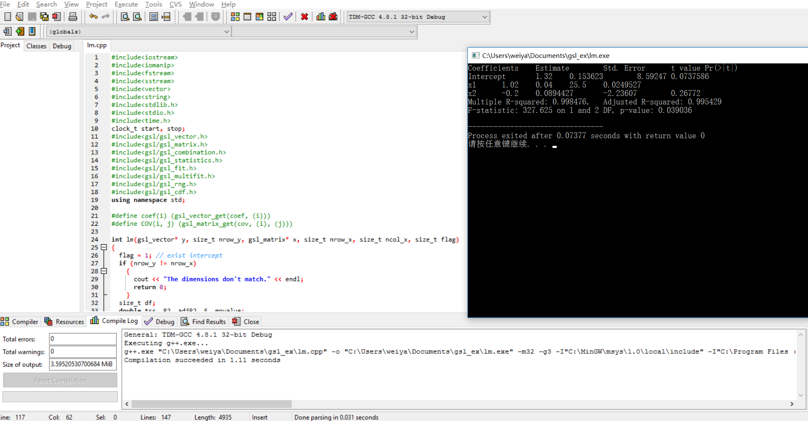

# GSLwin
GSL for windows.

## Update on 2017.09.08

Actually, we can compile lib and include for x64. Msys and mingw are two essential compenents. But this time I installed msys and mingw respectively, while I have installed the complex suite, which just for i386.

1. Download [MSYS-20111123.zip](https://phoenixnap.dl.sourceforge.net/project/mingw-w64/External%20binary%20packages%20%28Win64%20hosted%29/MSYS%20%2832-bit%29/MSYS-20111123.zip)
 and unzip.
2. Visit the website of [mingw_w64](http://mingw-w64.org/doku.php/download), and click Mingw-builds, you would download the mingw-w64-install.exe from sourceforge. Then you just run this file and install.
3. Note that we just install two seperate program, so we need to "connect" them. Open `msys.bat` and `mingw-w64.bat`, both locate in their respective installation directory. Copy the content in `mingw-w64.bat` and paste in the head of `msys.bat`. Then run `msys.bat`, you can use g++ and gcc, which belongs to mingw.
4. Now we can compile gsl. Download [gsl](ftp://ftp.gnu.org/gnu/gsl/) to the file folder of MSYS.
5. In the unix-like terminal, type
```
tar xzvf gsl-2.4.tar.gz
cd gsl-2.4
./configure
make
make install
```
When I run ./configure, there is a warning, "WARNING: cache variable lt_cv_path_LD contains a newline". As a result, I fail to run `make`. There is a solution [libtool](http://lists.gnu.org/archive/html/libtool/2009-05/msg00034.html). However, after I fix this bug, one more bug about libtool. And there are also [mail lists](https://lists.gnu.org/archive/html/libtool/2014-09/msg00005.html) talking about. But I failed to find a solution. I guess these bugs might be incompatible program. Because I choose the latest version when I install mingw_w64, while msys or gsl might not be updated. Then I adopt the mingw32 and mingw64 in Rtools. It need more time to test.


****

## Steps

1. Download [MinGW](http://www.mingw.org) and install.
2. In MinGW Installation Manager, choose all packages in basic setup and install.
3. In cmd, type 'msys.bat MSYS' to open a unix-like terminal.
4. Download [gsl](ftp://ftp.gnu.org/gnu/gsl/) to the file folder of MSYS.
5. In the unix-like terminal, type

```
cd gsl-2.4/
./configure
make
make install
```
6. The lib is in 'local/lib', and the include is in 'local/include'
7. Now, you can use gsl on windows.
```
g++ test.c -o out I"path/to/include" -L"path/to/lib" -lgsl -lgslcblas -lm
```

**NOTE: The include and lib in this repository are just for i386.**

## Setup Dev-C++

1. Choose Tools>Compiler Options, select one 32-bit compiler to configure, say `TDM-GCC 4.8.1 32-bit Release`. DO NOT use 64-bit!

1. Choose Tools>Compiler Options>Directories, then add the include and libraries path for gsl.

2. Choose Tools>Compiler Options>General, add the following commands when calling the linker
```
-lgsl -lgslcblas -lm
```

3. Compile and build a C/C++ program, say [lm.cpp](https://github.com/szcf-weiya/gsl_lm)

The results are as follows:


